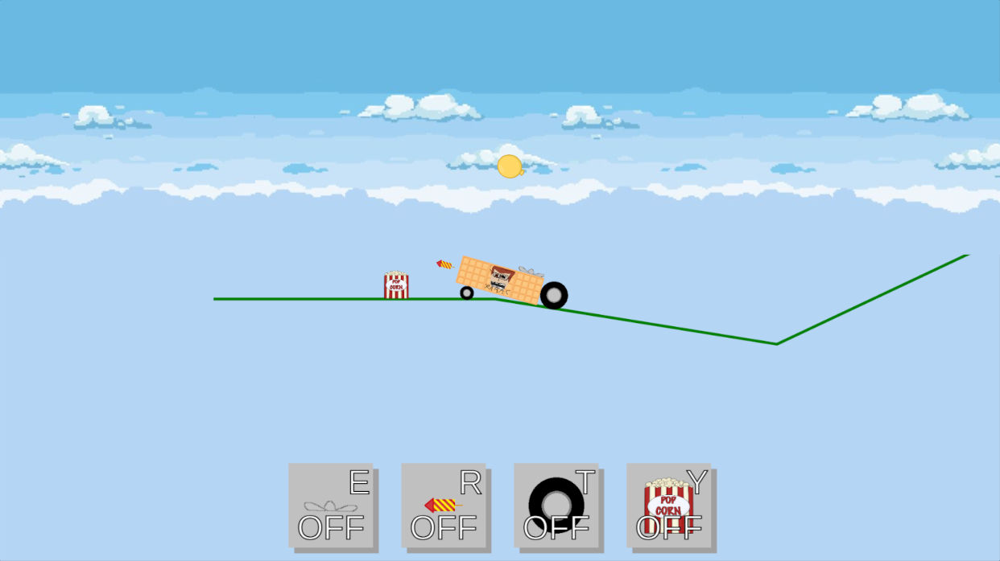

# Physics custom vehicles

Ce projet est un jeu inspiré de Bad piggies

Le but est de construire un véhicule qui évoluera dans un monde physique, il doit atteindre l'arrivée



Dépendences :
[box2d.js](https://github.com/kripken/box2d.js)[⁽ᵈᵒᶜ⁾](https://box2d.org/documentation/) (incluse)


## Installation

### Avec Docker 🐳

```bash
docker compose up -d
```

### Sans Docker 🐢

```bash
npm install
npm start
```

Ensuite, ouvrez votre navigateur à l'adresse [http://localhost:13029](http://localhost:13029)